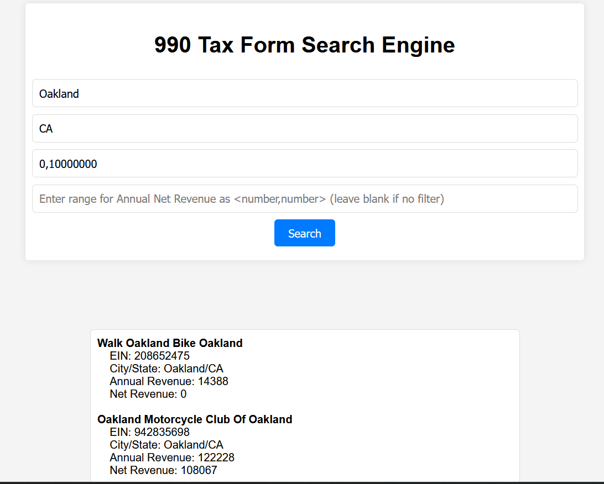

# Legends ASDA Documentation - Non-Profit Tax Return Search Enginge
Welcome to a prototype search engine for 990 tax forms. Developed in order to assist Non-Profit Organizations (NPOs) in streamlining their tax filing process. 
The search engine achieves this by creating a directory of over 100,000+ tax forms, reducing filing times by over 70%!

## Getting Started
It's a website so everything can run locally in your browser! All that's required is to clone the repository and run `flask run` to get updated tax data

### Dependencies
- Python2 to grab tax forms once a year
- python flask library
- python json library

### Supported Features
- US City/State filtering 
- Gross revenue 
- Net revenue
- Pagination
